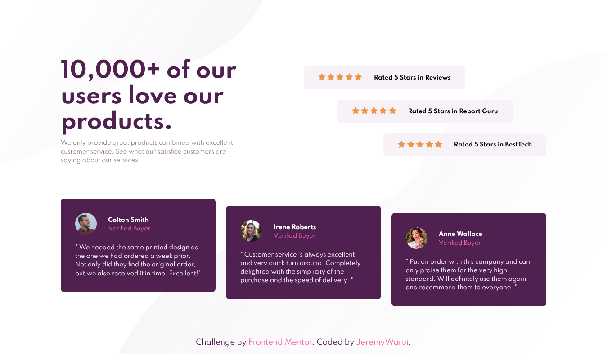

# Frontend Mentor - Social proof section solution

This is a solution to the [Social proof section challenge on Frontend Mentor](https://www.frontendmentor.io/challenges/social-proof-section-6e0qTv_bA). Frontend Mentor challenges help you improve your coding skills by building realistic projects.

## Screenshot

## My process

### Built with

- Semantic HTML5 markup
- CSS custom properties
- Flexbox

### What I learned

I can use two images in background-image property.
background-image:url(image), url(image)

Use of flex-box in aligning items. Ilign items is for aligning vertically while justify is for aligning horizontally

### Continued development

Working more on flexbox and use of CSS Grids would be more fun in using them. I am not comfortable yet on using them but the challenge is worth it. Looking forward for more
hen you look back on this project in the future.**

## Author

- Frontend Mentor - [@JeremyWarui](https://www.frontendmentor.io/profile/JeremyWarui)
# SocialProof-challenge git init git add README.md git commit -m first commit git branch -M main git remote add origin https://github.com/JeremyWarui/SocialProof-challenge.git git push -u origin main
# SocialProof-challenge
